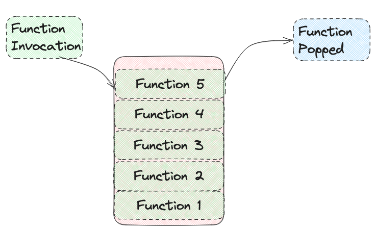

# In Memory Storage (JS Call Stack & Error Messages)

Reading assignment for Class 10

## Questions & Answers

[Understanding the JavaScript Call Stack](https://www.freecodecamp.org/news/understanding-the-javascript-call-stack-861e41ae61d4)

1. What is a 'call'? A function invocation.
2. How many 'calls' can happen at once? One at a time.
3. What does LIFO mean? Last In, First Out
4. Draw an example of a call stack and the functions that would need to be invoked to generate that call stake. 
5. What causes a Stack Overflow? Exceeded limit of function calls into the call stack.

---

[JavaScript Error Messages](https://codeburst.io/javascript-error-messages-debugging-d23f84f0ae7c)

1. What is a 'reference error'? When a variable is never declared or not within the scope.
2. What is a 'syntax error'? When programmer accidentally mistypes a specific key, or doesn't follow the rules set up by the specific language.
3. What is a 'range error'? When manipulating a data type like an array but trying to change the length in a way that is impossible.
4. What is a 'type error'? When types you are trying to use are inaccessible or incompatible. 
5. What is a breakpoint? A stopping point for a programmer to check their code and see if the values or data is flowing as intended.
6. What does the word 'debugger' do in your code? It acts as a breakpoint to the code.

## JavaScript Call Stack

> The JavaScript engine, is a single-threaded interpreter comprising a heap and a single call stack. The browser provides web APIs like DOM, AJAX, and Timers.

### Call Stack

> Call stack is a data structure that uses the Last In, First Out (LIFO) principle to temporarily store and manage function invocation (call).

It is done one at a time from top to bottom, making the call stack synchronous.

**LIFO:** This means that the last function that got pushed into the stack is the first to be popped out, when the function returns.

```javascript
function firstFunction(){
  throw new Error('Stack Trace Error');
}

function secondFunction(){
  firstFunction();
}

function thirdFunction(){
  secondFunction();
}

thirdFunction();
```

In the example above the Stack trace error would have the firstFunction on top, then the second, then the third. It makes sense as the function wouldn't finish until the function that they called is finished. So being that the third calls the second, which calls the first, it would have to finish the first, then the second would finish, then the third. A bit wordy and can lead to confusion, but it all makes sense.

When a function is called the function, parameters, and variables are all pushed into the call stack and form a stack frame. It stored as memory, until the function returns and is popped out of the stack.

### Stack Overflow

This is caused when function invocations exceed a call size.

## JavaScript Errors

### Reference Errors

An error when trying to use a variable that is not yet declared.

```javascript
// Uncause ReferenceError: `variable name` is not defined
```

### Syntax Errors

Occurs when something that cannot be executed do to an error with the Syntax.

### Range Errors

Trying to manipulate an object with an invalid length.

```javascript
let foo = [];
foo.length = foo.length - 1 // Uncaught RangeError: Invalid array length
```

### Type Errors

When types of data are being used or accesses in an incompatible way.

```javascript
let foo = {}
foo.bar // undefined
foo.bar.baz // Uncaught TypeError: Cannot read property 'baz' of undefined
```

### Debugging

You can add breakpoints within your code, and with the help of Node.js to be able to stop and test code at certain points to follow along and see where and why the error is occurring.
