# Introduction to SQL

[Source](https://www.computer-pdf.com/3-sql-database-tutorial-for-beginners)

Considered most popular database.

## What is SQL?

Query language used to access a database.

Common SQL supported databases:

* Oracle
* SQL Server
* MySQL
* Sybase
* PostgreSQL

## Getting Started

### Create a new database

`Create DATABASE sql_name;`

### Insert data into a table

`INSERT INTO users (username, password) VALUES ('username', 'password');`

### Query data from a table

`SELECT * FROM users;`

### Update data in a table

`UPDATE users SET password = 'new_password' WHERE username = 'username';`

### Delete data from a table

`DELETE FROM users WHERE username = 'username';`

## SQLBolt

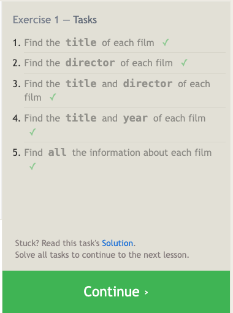
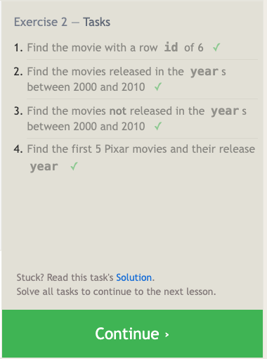
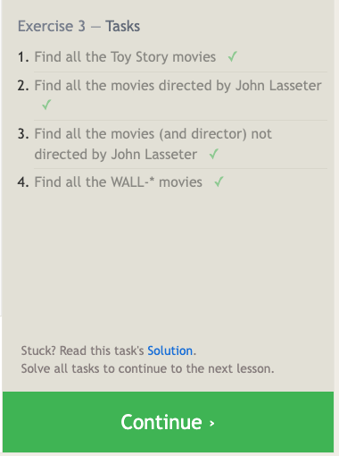
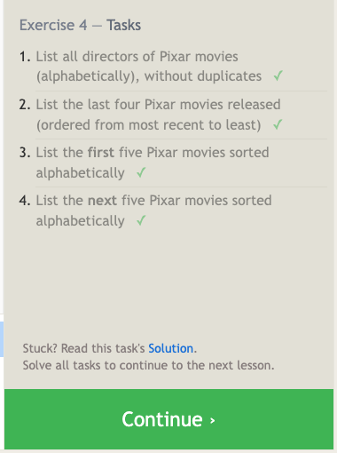

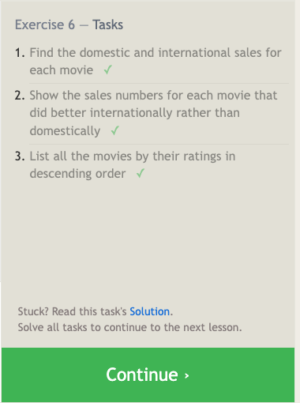
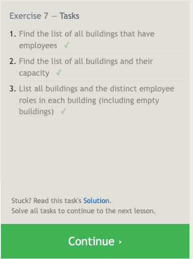
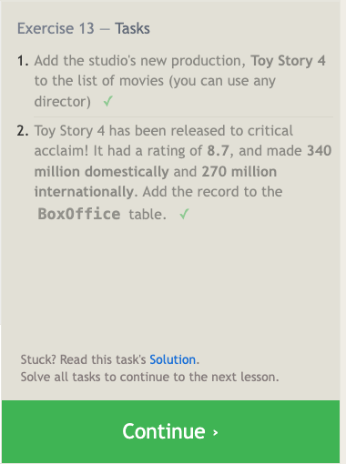
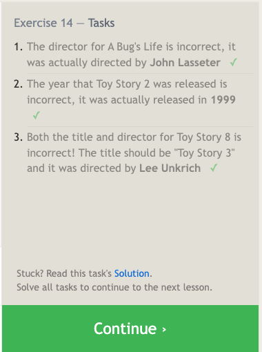
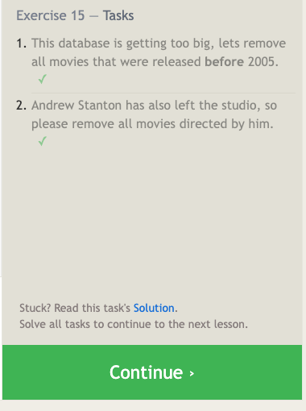
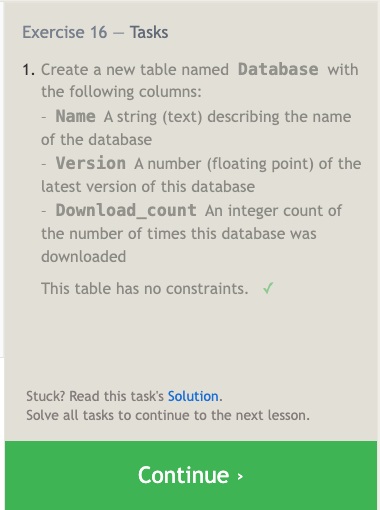
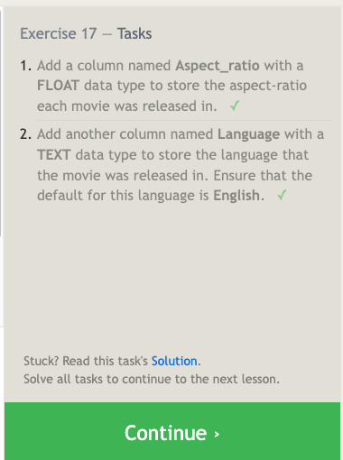
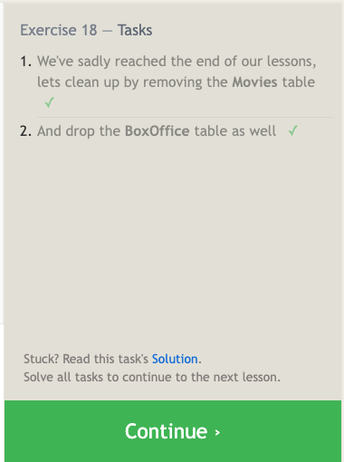
